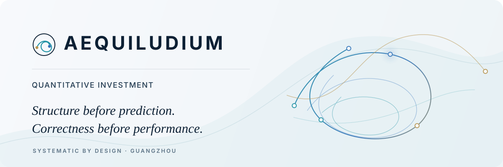
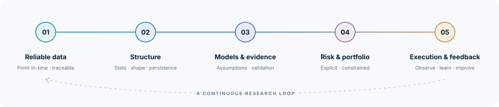

<picture>
  <source media="(prefers-color-scheme: dark)" srcset="./assets/hero-dark.svg">
  <source media="(prefers-color-scheme: light)" srcset="./assets/hero-light.svg">
  
</picture>

  <strong>Quantitative Investment · Guangzhou, China</strong> 
  China equities · Futures · Options

---

## Markets are dynamic systems.

Markets are not static tables waiting to be predicted. They are evolving structures, continuously reshaped by information, liquidity, expectations, behavior, and risk.

At **Aequiludium**, we study those structures and build the research and engineering systems required to invest in them with discipline. We are a quantitative investment team based in Guangzhou, focused on China's equity, futures, and options markets.

The name **Aequiludium** reflects a simple observation: markets are always seeking balance, yet never remain there. Our work begins with understanding that balance in motion.

 

## How we think

<table>
  <tr>
    <td width="33%" valign="top">
      <h3>01 · Structure</h3>
      <strong>Before prediction.</strong>  
      We begin with representation: what is the state of the market, which relations persist, and which apparent patterns are artifacts of the chosen coordinates?
    </td>
    <td width="33%" valign="top">
      <h3>02 · Correctness</h3>
      <strong>Before performance.</strong>  
      A model with sound assumptions matters more than one that merely scores well. A valid strategy matters more than one that simply looks good in a backtest.
    </td>
    <td width="33%" valign="top">
      <h3>03 · System</h3>
      <strong>By design.</strong>  
      Investment ability is not a single model. It is the full process connecting data, research, risk, portfolio construction, execution, and feedback.
    </td>
  </tr>
</table>

 

## A topological point of view

Low-dimensional topology and **topological data analysis** are part of our research DNA. They influence how we reason about shape, connectivity, persistence, regimes, and the geometry of market states.

This is not a claim that every problem needs topology. It is a commitment to ask a more fundamental question before fitting a model:

> **Have we represented the structure of the problem correctly?**

 

## From research to investment

<picture>
  <source media="(prefers-color-scheme: dark)" srcset="./assets/process-dark.svg">
  <source media="(prefers-color-scheme: light)" srcset="./assets/process-light.svg">
  
</picture>

Our engineering practice is an extension of our investment philosophy. Point-in-time correctness, explicit assumptions, reproducible research, clear system boundaries, and realistic constraints are not implementation details. They determine whether an investment result can be trusted.

We therefore optimize for a process that can be **examined, challenged, reproduced, and improved**—not for the most impressive isolated result.

 

## Our markets

| China equities | Futures | Options |
| :--- | :--- | :--- |
| Cross-sectional structure, fundamentals, market behavior, and portfolio construction. | Time-varying regimes, risk transmission, and systematic exposure across contracts. | Nonlinear payoffs, volatility structure, and disciplined risk expression. |

 

## Open source

Most of our research and investment systems remain private. We selectively open-source infrastructure when it can be useful without exposing proprietary research.

**[alpha-common](https://github.com/Aequiludium/alpha-common)**  
Shared Python infrastructure for quantitative research workflows.

 

---

  <strong>Structure before prediction.</strong> 
  <strong>Correctness before performance.</strong> 
  <strong>Systematic by design.</strong>  
  AEQUILUDIUM · GUANGZHOU, CHINA

